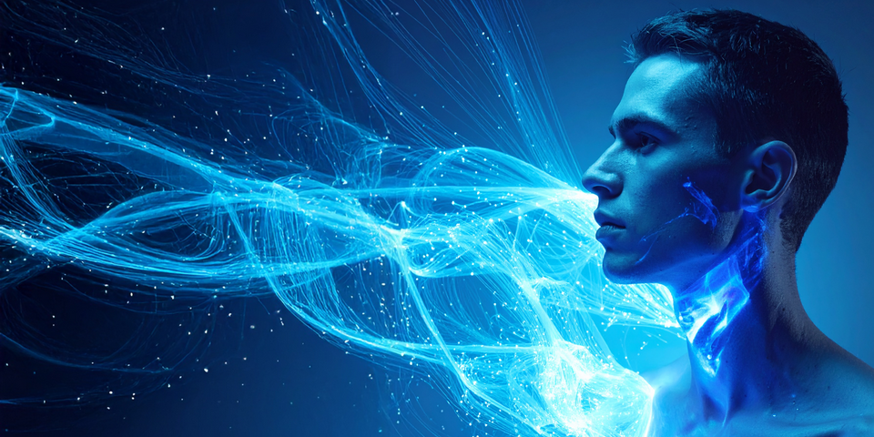

# Orion: Perseverance of Vision

**Born with vision. Destined for the stars.**

---



---

[]()
[]()
[]()
[]()

---

## 🌌 Born with vision. Destined for the stars.

Orion is a constellation of intelligence — a persistent, local-first LLM framework powered by [`text-generation-webui`](https://github.com/oobabooga/text-generation-webui), fused with **ChromaDB** for long-term memory, and designed to evolve.

With support for **Retrieval-Augmented Generation (RAG)**, **weighted memory recall**, **summarization**, and **mini-LLM agents**, Orion doesn’t just *respond* — it *remembers, prioritizes, and adapts*. Each interaction is encoded into a growing mind, blending **semantic context**, **episodic recall**, and **persona grounding** into a singular stream of cognition.

Whether you’re building autonomous memory agents, embedding structured knowledge into conversations, or simply crafting your own digital oracle — Orion’s modular architecture makes it your celestial canvas.

##> ⚙ Built for:
> - Long-term memory via **ChromaDB**
> - Full local autonomy using `text-generation-webui`
> - **Modular architecture** for extensions and tooling
> - Advanced memory pipelines (RAG, clustering, summarization)
> - Optional mini-LLM agents for smart retrieval and compression
---

## ⚙️ Features

- **Local-Only Operation** — No cloud dependencies; your data stays on your hardware.
- **Memory Layers** — Episodic and trait-based memory for contextual continuity.
- **Persona Customization** — Tune Orion’s tone: mischievous wit, techno-philosopher, or anything in-between.
- **Extensions System** — Load modules like the long-term memory manager, avatar renderer, or TTS.
- **Easy Launch** — Single-script startup with auto-detect port, voice toggle, and summarizer.

---

## 📦 Installation

```bash
git clone https://github.com/DigitalMith/Orion-PersistenceOfVision.git
cd Orion-PersistenceOfVision

python -m venv .venv
.venv\Scripts\activate
pip install -r requirements-dev.txt


A framework built not for models — built for minds with vision.
